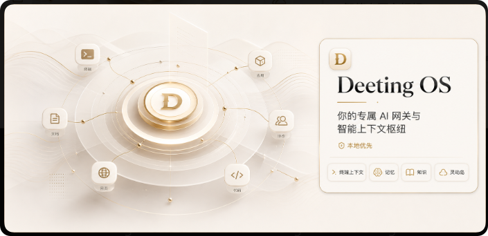
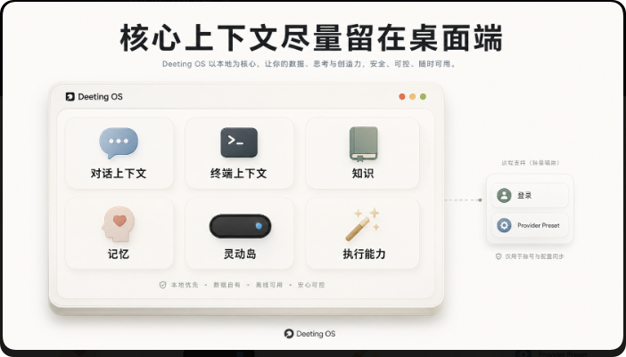
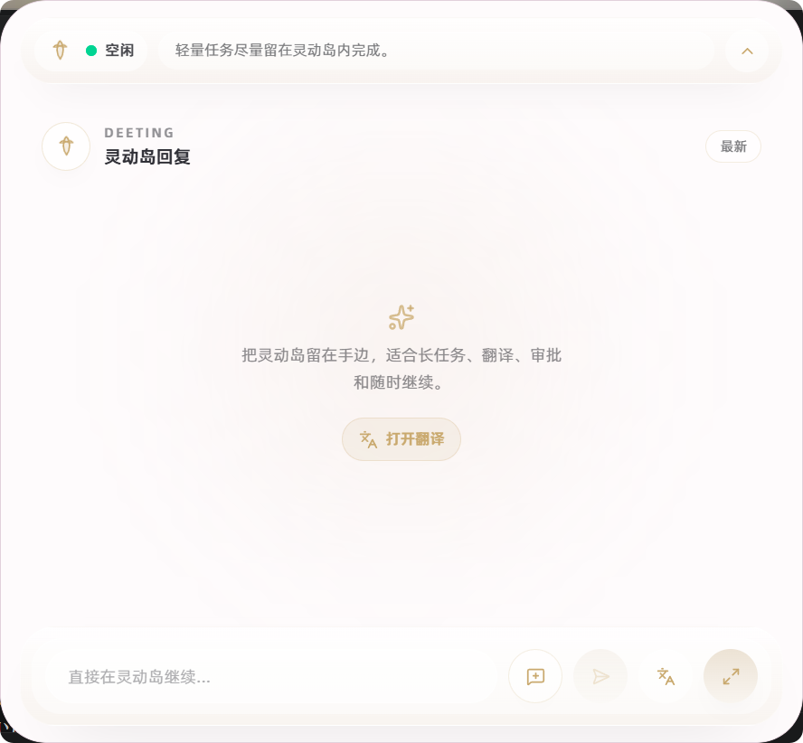
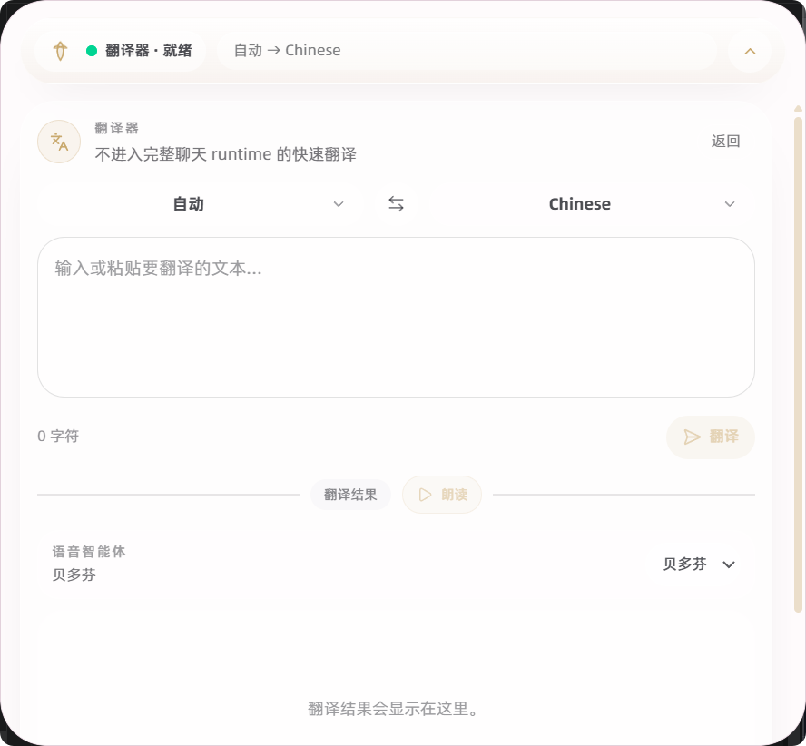
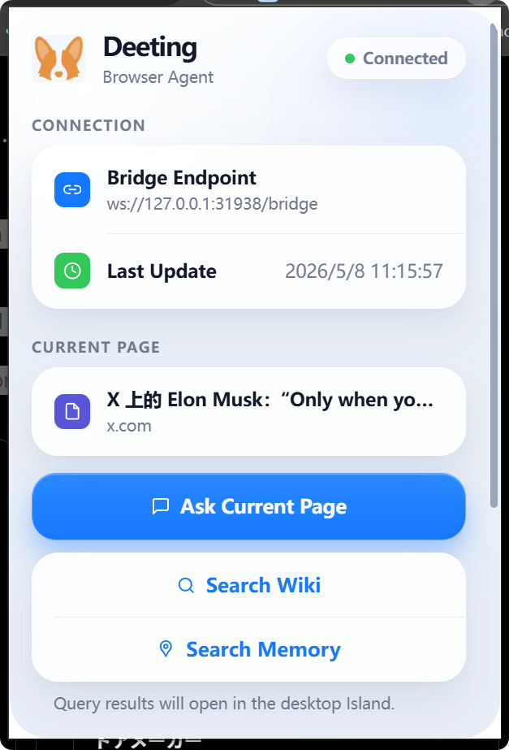
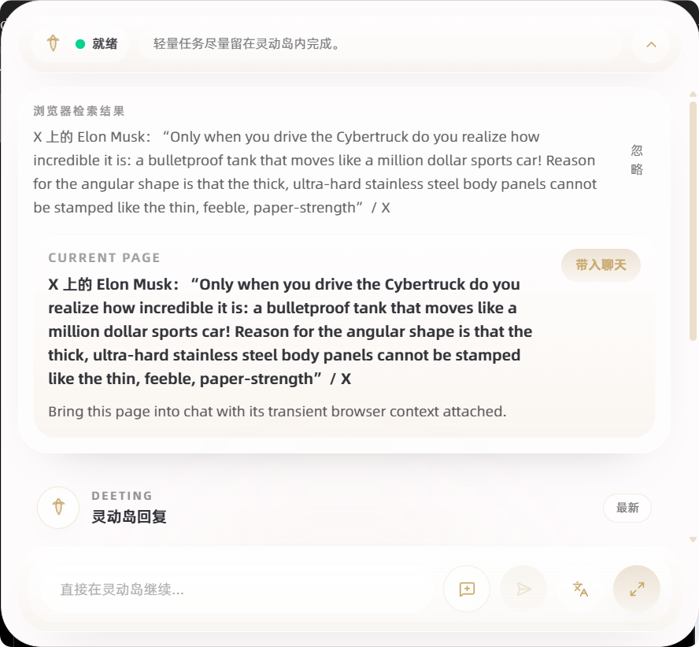
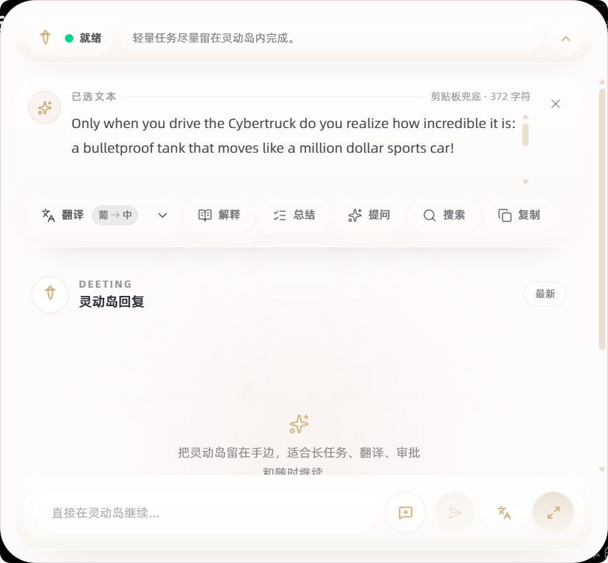
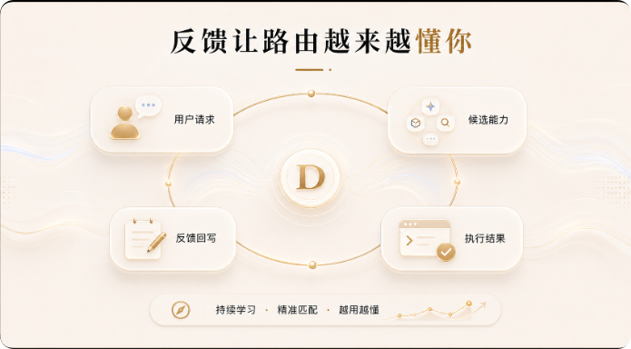
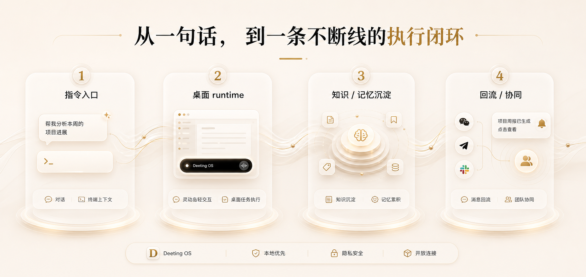

<div align="center">
  
  <h1>Deeting OS</h1>
  <p><strong>Your personal AI gateway and intelligent context hub</strong></p>
  <p>Local-First AI Gateway & Context Hub</p>
  <p>
    <a href="https://github.com/MarshallEriksen-Neura/Deeting/releases">Download Latest Release</a>
    ·
    <a href="./README.md">中文 README</a>
    ·
    <a href="./docs/macos-installation-en.md">macOS Installation</a>
    ·
    <a href="./docs/rag-architecture.en.md">RAG Architecture</a>
    ·
    <a href="./docs/self-evolution-architecture.en.md">Self-Evolution Architecture</a>
    ·
    <a href="./docs/agent-dag-architecture.en.md">Agent DAG Architecture</a>
    ·
    <a href="./docs/tool-architecture.en.md">Tool Architecture</a>
    ·
    <a href="./docs/memory-architecture.en.md">Memory System</a>
    ·
    <a href="./docs/security-architecture.en.md">Security Architecture</a>
    ·
    <a href="./docs/bandit-architecture.en.md">Bandit Architecture</a>
    ·
    <a href="./docs/dual-plane-architecture.en.md">Dual-Plane Execution</a>
    ·
    <a href="#quick-start">Quick Start</a>
  </p>
</div>

<p align="center">
  
  
  
  
  
</p>

Deeting OS is a local-first desktop AI workstation. It pulls AI conversation, tool use, knowledge retrieval, memory accumulation, terminal context, Island interaction, and IM collaboration into a single runtime, making the desktop itself the working surface for AI.

<p align="center">
  
</p>

## What Deeting Is

- You talk to AI on the desktop, and the model has access to local knowledge, memory, tools, documents, and terminal context at the same time.
- One-off answers can be turned into reusable skills, knowledge entries, workflow templates, and collaboration surfaces.
- Model config, knowledge assets, and tool execution stay on the host. The desktop app is the runtime itself.

## What It Solves

Common gaps in existing AI products:

- The model has no visibility into the real context on your machine.
- Valuable information is scattered across chats, folders, docs, group threads, and terminal sessions, with no durable accumulation.
- Tool calls and workflows are one-off; you re-explain them every time.
- IM collaboration, tool use, local execution, and knowledge retrieval live in separate systems with no unified entry point.

Deeting pulls those boundaries back into the desktop.

<p align="center">
  
</p>

<p align="center"><em>Core context stays on the desktop. Remote services play a minimal supporting role.</em></p>

## Core Capabilities

### 1. Local-first desktop AI workstation

Built on `Next.js 16 + React 19 + Tauri 2 + Rust`. The desktop app owns conversation, tool routing, runtime orchestration, and local capability access, while keeping a modern web UI.

### 2. AI gateway and runtime orchestration

The Rust backend exposes `desktop_runtime`, `execution`, `skills`, `mcp`, `providers`, `workflow`, and related modules to handle tool execution, skill invocation, model routing, and local orchestration.

### 3. Terminal context inside the chat loop

The chat route embeds a real terminal. Each request can attach terminal context that the model reads on demand. The terminal protocol layer supports command boundaries, context snapshots, and send-to-AI actions.

### 4. Local knowledge and LLM Wiki

Local knowledge assets, indexing, and retrieval. The dedicated `llm_wiki` module owns semantic knowledge flows including corpus maintenance, automation, watchers, and ongoing upkeep. It turns scattered notes, docs, references, and project material into a durable local knowledge layer.

### 5. Memory system

Long-running memory storage, search, snapshots, and rollback. Chat history and memory are kept separate, which fits a persistent personal AI better.

### 6. Island interaction layer

- The chat route mounts `IslandShell`. A dedicated `island` window is pre-created on the Tauri side with show/hide, sizing, positioning, and global shortcut support.
- It carries status, quick actions, approvals, selection-driven actions, and reply handoff.
- Highlighting text exposes `Translate`, `Explain`, `Summarize`, `Ask`, `Search`, and `Copy` directly inside Island.
- Translation is fully wired: quick translate, target language picking, recent target memory, and clipboard-seeded translation when opened manually.

<p align="center">
  
</p>

<p align="center"><em>Island is a lightweight desktop interaction surface that stays close at hand.</em></p>

<p align="center">
  
</p>

<p align="center"><em>Translation lives inside Island. No need to jump back into the full chat runtime to translate text.</em></p>

### 7. Browser execution surface

- The Chrome extension at `packages/deeting_chrome/` is the bounded browser action surface for the desktop runtime.
- The desktop AI makes decisions; the extension executes browser-side actions over a localhost WebSocket bridge.
- Capabilities: connect to desktop, open tabs, read structured page snapshots, execute bounded click/type/scroll actions, and gate high-risk actions behind approval.

<p align="center">
  
</p>

<p align="center"><em>The browser-side surface connects to the current page and triggers actions such as Ask Current Page, Search Wiki, and Search Memory.</em></p>

<p align="center">
  
</p>

<p align="center"><em>Browser results flow back into the desktop Island, and can be brought into the main chat workspace from there.</em></p>

### 8. Compatibility-oriented extension surface

`packages/`, `skills`, and `mcp` extension surfaces remain in the repo. The product reuses existing ecosystems rather than forcing a fully custom plugin path.

### 9. Local execution and sandboxing

BoxLite sidecar and sandbox modules support local code execution, document generation, and execution-oriented workflows.

### 10. IM as an entry point

The IM module covers Feishu, Telegram, and WeChat. The desktop app does not expose a public callback endpoint; `deeting-relay/` owns that boundary. The desktop executes, IM delivers contact.

## Real Usage Scenarios

### Scenario 1: Debugging with terminal context attached

You are running a project locally, watching logs, and issuing shell commands. The real problem lives in the current shell state, recent commands, command output, and working directory — not just in one pasted error block. The chat chain attaches terminal context so the model sees a snapshot of the real desktop situation. When the main window is not in focus, Island holds the relevant status, actions, and handoff path.

### Scenario 2: Approvals, selected text, and quick replies without returning to the full window

Island holds lightweight interaction state including recent messages, pending approvals, selection context, browser lookup, and quick reply. Highlight a piece of text and trigger `Translate`, `Explain`, `Summarize`, `Ask`, `Search`, or `Copy` straight from Island — no need to paste it back into the main workspace.

<p align="center">
  
</p>

<p align="center"><em>The selected-text action strip brings translate, explain, summarize, ask, search, and copy onto the reading surface.</em></p>

### Scenario 3: Turning scattered material into a durable local knowledge layer

Project docs, meeting notes, technical research, screenshots, and references are usually scattered across directories and tools. Knowledge, memory, and `llm_wiki` work together: ingest, structure, retrieve, reuse. The next time you come back, you do not start from scratch.

### Scenario 4: Desktop executes, IM is the outer contact surface

Teams want AI reachable from Feishu or other IM platforms, but model setup, knowledge assets, tool execution, and local environment state should not sit on a public callback surface. IM events enter `deeting-relay`, the desktop pulls and executes them, and results flow back outward. The desktop owns runtime and context; IM is the collaboration entry point.

## Architecture Overview

### 1. The desktop app is the real runtime

The main application lives in `deeting/`. The frontend handles UI; Tauri + Rust own the runtime. `deeting/src-tauri/src/modules/` exposes `desktop_runtime`, `execution`, `terminal`, `knowledge`, `memory`, `llm_wiki`, `skills`, `mcp`, `providers`, `workflow`, `sandbox`, and related modules that together handle model calls, tool routing, execution control, state, knowledge retrieval, and extension entry points. Chat, terminal, knowledge, and memory share the same context system and feed into the same runtime chain.

### 2. Entry surfaces surround the runtime

- **Island** (`IslandShell` + dedicated window + global shortcuts): desktop surface layer for status, quick reply, approvals, and selected-text actions.
- **Browser execution surface** (`packages/deeting_chrome/`): the desktop AI is the decision surface; the extension is the bounded browser execution surface. Read pages, take actions, return results.
- **IM entry** (`deeting-relay/`): external messages enter the relay boundary first, and the desktop consumes them from there.

All three entry chains share the same runtime. The desktop is always the context center.

### 3. Extension surface stays open

`skills` / `mcp` modules, the `packages/` extension surface, plus local execution and sandboxing form an open base. Existing ecosystems are preferred where possible.

<p align="center">
  
</p>

<p align="center"><em>Feedback writes back into routing so it tracks real usage preferences.</em></p>

> 📖 For the RAG / context orchestration subsystem (Context Orchestrator, three retrieval sources, context tools, the No Double Lifecycle Rule, selected-knowledge fallback chain), see [docs/rag-architecture.en.md](./docs/rag-architecture.en.md).
>
> 📖 For the self-evolution / self-adjustment subsystem (Sovereign Charter, TaskFingerprint, 6 decision points, prior half-decay, bandit tie-breaker, posterior signals, Ingress boundary), see [docs/self-evolution-architecture.en.md](./docs/self-evolution-architecture.en.md).
>
> 📖 For the Agent DAG execution model (4 node types / 11 statuses, execution-graph persistence, Approval Gate, Direct/Worker planes, three-layer In-Flight Stage state machine, cross-process recovery path), see [docs/agent-dag-architecture.en.md](./docs/agent-dag-architecture.en.md).
>
> 📖 For the tool architecture (model-visible tool catalog, capability registry and `search_sdk`, dual-track `SKILL.md` / `llm-tool.yaml` packaging, and unified execution/approval across skills, MCP tools, and shell execution), see [docs/tool-architecture.en.md](./docs/tool-architecture.en.md).
>
> 📖 For the memory system (multi-source writes, three-action Write Guard, Supersession semantics, 6 decay profiles, Vitality scoring, Fact Extractor long-term facts, snapshot audit), see [docs/memory-architecture.en.md](./docs/memory-architecture.en.md).
>
> 📖 For the security architecture (three-dimensional risk model, operation × target × boundary classification, Approval Gate, SessionApprovalGrant session-level grants, BoxLite multi-backend sandbox, sensitive paths and private-network defense), see [docs/security-architecture.en.md](./docs/security-architecture.en.md).
>
> 📖 For the multi-armed bandit architecture (Thompson / UCB / ε-greedy strategies, routing / worker selection / memory recall scenes, ROUTE_BANDIT_COEFF tie-breaking, cooldown failure protection, bit-aligned with the Python implementation), see [docs/bandit-architecture.en.md](./docs/bandit-architecture.en.md).
>
> 📖 For the dual-plane execution architecture (Direct vs Worker modes, shared 8-step orchestration pipeline, RouteSelectionStep decision flow, safety-lock list, Worker auto-delegation vs model-initiated delegate_task, Workflow engine path, delegated_result envelope), see [docs/dual-plane-architecture.en.md](./docs/dual-plane-architecture.en.md).

## A More Truthful Workflow

1. Start a conversation or task on the desktop.
2. Deeting pulls in local knowledge, memory, tools, terminal context, or document assets on demand.
3. The desktop runtime handles model calls, tool orchestration, execution, and result return.
4. Valuable output gets accumulated into knowledge, memory, templates, or reusable workflows.

<p align="center">
  
</p>

## Who It Is For

- Individual developers or heavy desktop users who want AI to connect to the real local environment.
- Product builders who want knowledge, memory, tools, and conversation unified inside one workstation.
- Builders who care about skills, document generation, knowledge retrieval, or IM-connected execution flows.
- Teams that want AI to behave like a real desktop workstation.

## Quick Start

### Installation

Download the latest release from [GitHub Releases](https://github.com/MarshallEriksen-Neura/Deeting/releases).

#### Windows

Download `Deeting Setup_x.x.x_x64-bootstrapper.exe` and run the graphical installer.

#### macOS

The current macOS build is not notarized, so first launch needs an extra confirmation step. See [macOS Installation](./docs/macos-installation-en.md).

#### Linux

Download the `.deb` or `.AppImage` package and install it in the usual way.

### Before first launch

1. Have `Python 3` and `Node.js` available on the host.
2. Prepare at least one usable model service configuration.
3. Prepare at least one embedding model for knowledge and memory features.

### Suggested first-run order

1. Install and open Deeting.
2. Go to the dashboard and configure your AI service.
3. Pull or sync the model list once from the model page.
4. Run the agent runtime check in settings.
5. Configure the desktop assistant model and embedding model.
6. Set your preferred Island shortcut and main-window close behavior.
7. Start using chat, knowledge, memory, and Island.

## Development

The main desktop application lives in [`deeting/`](./deeting/).

### Start the frontend development environment

```bash
cd deeting
bun install
bun run dev
```

### Start the desktop development environment

```bash
cd deeting
bun install
bun run desktop:dev
```

### Build the desktop application

```bash
cd deeting
bun run desktop:build
```

`deeting/scripts/tauri-with-protoc.mjs` resolves and injects `PROTOC` automatically before running Tauri commands.

## Repository Structure

```text
.
├─ deeting/           # Main desktop app (Next.js + Tauri + Rust)
├─ deeting_core/      # Core backend / task and test assets
├─ deeting-relay/     # IM relay service as public ingress boundary
├─ installer/         # Windows graphical installer
├─ scout/             # Standalone reconnaissance / crawling service
├─ packages/          # Extension-related templates, SDK, and compatibility assets
│  └─ deeting_chrome/ # Chrome browser execution extension
├─ docs/              # Documentation and README images
└─ scripts/           # Helper scripts
```

Key directories:

- [`deeting/`](./deeting/): main product entry, including frontend UI, the Tauri shell, and Rust modules.
- [`deeting-relay/`](./deeting-relay/): puts Feishu and other IM callbacks behind a relay before the desktop executes them.
- [`packages/`](./packages/): extension-related templates, SDK, and compatibility assets.
- [`packages/deeting_chrome/`](./packages/deeting_chrome/): browser execution surface.
- [`scout/`](./scout/): web reconnaissance, scraping, and deep-crawling service.

## Major Capability Domains Already Present

`deeting/src-tauri/src/modules/` currently contains:

- `desktop_runtime`
- `execution`
- `terminal`
- `knowledge`
- `memory`
- `llm_wiki`
- `skills`
- `mcp`
- `providers`
- `workflow`
- `generated_files`
- `image_generation`
- `im`
- `sandbox`

> 📖 `desktop_runtime/context_orchestrator/` + `knowledge` + `memory` + `llm_wiki` + `retrieval_kernel` together form the local RAG / context orchestration subsystem. See [docs/rag-architecture.en.md](./docs/rag-architecture.en.md). The companion subsystems for self-adjustment and DAG execution are documented in [docs/self-evolution-architecture.en.md](./docs/self-evolution-architecture.en.md) and [docs/agent-dag-architecture.en.md](./docs/agent-dag-architecture.en.md).

## Subprojects

### `deeting-relay`

Lightweight relay service that accepts Feishu and other IM callbacks, then forwards them to the local desktop runtime.

### `scout`

Standalone reconnaissance service for web extraction, anti-bot handling, and deep crawling. Suited to external knowledge acquisition.

### `packages`

Extension-related toolbox containing SDKs, templates, and compatibility assets.

### `installer`

Windows graphical installer that packages the main app into a friendlier installation path.

## Star History

<a href="https://www.star-history.com/?repos=MarshallEriksen-Neura%2FDeeting&type=date&legend=top-left">
 <picture>
   <source media="(prefers-color-scheme: dark)" srcset="https://api.star-history.com/image?repos=MarshallEriksen-Neura/Deeting&type=date&theme=dark&legend=top-left" />
   <source media="(prefers-color-scheme: light)" srcset="https://api.star-history.com/image?repos=MarshallEriksen-Neura/Deeting&type=date&legend=top-left" />
   
 </picture>
</a>

## Community and Updates

If you value `sincerity`, `friendliness`, `solidarity`, and `professionalism`, join us at [LinuxDo](https://linux.do/latest).

Deeting updates are posted at: [Deeting update thread / discussion](https://linux.do/t/topic/2070886)

