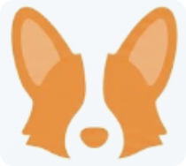

  
  <h1>Deeting OS (谛听)</h1>
  
<strong>你的专属 AI 网关与智能上下文枢纽</strong>

  
Local-First AI Gateway & Context Hub

  

    <a href="https://github.com/MarshallEriksen-Neura/Deeting/releases">下载最新版</a>
    ·
    <a href="./docs/macos-installation.md">macOS 安装说明</a>
    ·
    <a href="#快速开始">快速开始</a>
  

  
  
  
  
  

Deeting OS 是一个本地优先的桌面 AI 平台。它不是单纯的聊天壳子，而是把 AI 对话、技能调用、知识检索、记忆沉淀与 IM 协同收拢到同一个工作台里。

## 开源信号

如果你除了想知道“它是什么”，还想知道“它是不是一个活着的开源项目”，这里直接给你最重要的那张图：

## Star History

<a href="https://www.star-history.com/?repos=MarshallEriksen-Neura%2FDeeting&type=date&legend=top-left">
 <picture>
   <source media="(prefers-color-scheme: dark)" srcset="https://api.star-history.com/image?repos=MarshallEriksen-Neura/Deeting&type=date&theme=dark&legend=top-left" />
   <source media="(prefers-color-scheme: light)" srcset="https://api.star-history.com/image?repos=MarshallEriksen-Neura/Deeting&type=date&legend=top-left" />
   
 </picture>
</a>

