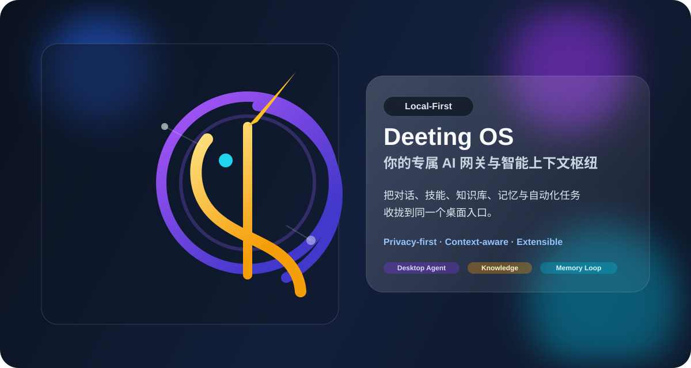
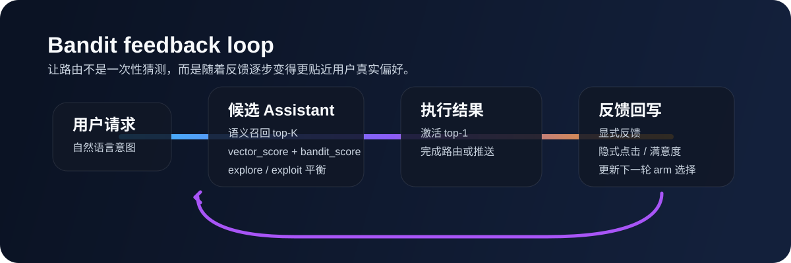
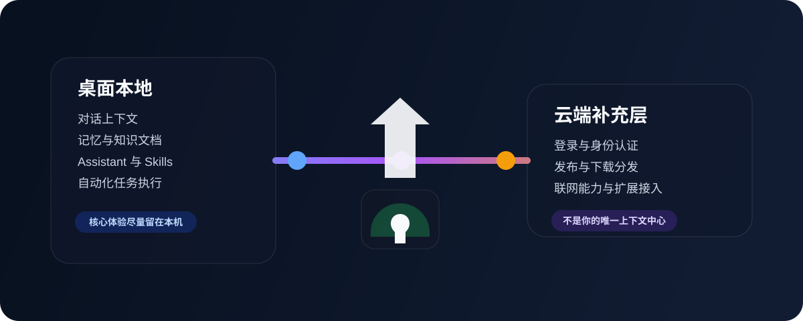
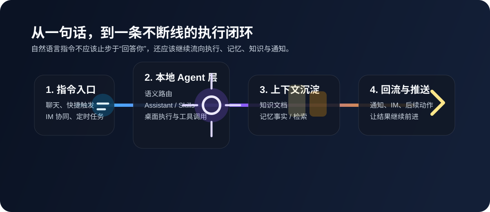

<div align="center">
  
  <h1>Deeting OS (谛听)</h1>
  <p><strong>你的专属 AI 网关与智能上下文枢纽</strong></p>
  <p>Local-First AI Gateway & Context Hub</p>
  <p>
    <a href="https://github.com/MarshallEriksen-Neura/Deeting/releases">下载最新版</a>
    ·
    <a href="./docs/macos-installation.md">macOS 安装说明</a>
    ·
    <a href="#快速开始">快速开始</a>
  </p>
</div>

<p align="center">
  
  
  
  
  
</p>



> [!TIP]
> 如果你只是想马上开始用，直接前往 [GitHub Releases](https://github.com/MarshallEriksen-Neura/Deeting/releases)。
> Windows 用户优先下载 `Deeting Setup_x.x.x_x64-bootstrapper.exe`。

Deeting OS 是一个本地优先的桌面 AI 平台。它不是单纯的聊天壳子，而是把 AI 对话、技能调用、知识检索、记忆沉淀与 IM 协同收拢到同一个工作台里，尽量让核心上下文留在你的本机，云端主要承担登录、分发与联网能力的补充。

## 开源信号

如果你除了想知道“它是什么”，还想知道“它是不是一个活着的开源项目”，这里直接给你最重要的那张图：

## Star History

<a href="https://www.star-history.com/?repos=MarshallEriksen-Neura%2FDeeting&type=date&legend=top-left">
 <picture>
   <source media="(prefers-color-scheme: dark)" srcset="https://api.star-history.com/image?repos=MarshallEriksen-Neura/Deeting&type=date&theme=dark&legend=top-left" />
   <source media="(prefers-color-scheme: light)" srcset="https://api.star-history.com/image?repos=MarshallEriksen-Neura/Deeting&type=date&legend=top-left" />
   
 </picture>
</a>

## 硬能力，不是空话

<table>
  <tr>
    <td width="50%" valign="top">
      
      <br />
      <strong>主动巡猎 + 定时触发 + 飞书回流</strong>
      <br />
      不是只会等你来问。平台内有 monitor / scheduler 路径，可以按计划触发 AI Agent 运行；结果既能在系统内沉淀，也能通过 relay 回流到飞书消息链路。
    </td>
    <td width="50%" valign="top">
      
      <br />
      <strong>Bandit 反馈抉择</strong>
      <br />
      不是把推送和路由写死。Assistant 路由已经引入 vector + bandit 混合评分，让系统能根据反馈逐步调整探索与利用的平衡。
    </td>
  </tr>
  <tr>
    <td width="50%" valign="top">
      
      <br />
      <strong>模板映射，少写适配胶水</strong>
      <br />
      通过 request template、template render、output mapping 等机制，把不同模型和上游接口的差异压成统一调用面，省掉大量重复的 AI 适配代码。
    </td>
    <td width="50%" valign="top">
      
      <br />
      <strong>基于语义自动抉择合适 Assistant</strong>
      <br />
      系统会按语义召回本地候选 Assistant，在置信度达标后自动激活 top-1，而不是每次都让用户先手动决定要切到哪个专家。
    </td>
  </tr>
  <tr>
    <td colspan="2" width="100%" valign="top">
      
      <br />
      <strong>Memory 会自动提取 Fact</strong>
      <br />
      会话空闲后可触发记忆抽取链路，把值得保留的事实沉淀下来；同时围绕活力衰减、回滚和清理，逐步把记忆做成有生命周期治理的系统，而不是只堆向量。
    </td>
  </tr>
</table>

### 反馈闭环长什么样



这不是一次性路由。候选 Assistant 的语义分数、Bandit 分数和后续反馈会继续进入下一轮选择，让系统逐步学会什么结果更让用户满意。

## 为什么它不是另一个聊天壳

- **它把执行链路也算进去**：不只负责回答你，还把巡猎、调度、推送、知识回流和记忆沉淀串成闭环。
- **它把上下文当成基础设施来做**：Assistant、Knowledge、Memory、Skills 不是散落在不同页面上的功能点，而是同一张桌面工作台的一部分。
- **它尽量让差异留在系统内部**：通过模板映射、语义路由和本地优先架构，把模型差异、工具差异和工作流复杂度更多地吸收在底层。

## Deeting 里的 Subagent，不是黑盒分身

很多 AI 产品提到 subagent，本质上还是“主模型在内部再叫几个分身”，用户通常只能看到最后一句总结。

Deeting 想做的不是这种黑盒。

在桌面端里，subagent 更接近一套受控的本地执行模型：

- `Primary Assistant`：负责理解你的意图，决定是直接回答、交给单个 worker，还是进入 workflow。
- `Worker Template`：可被选择的执行模板。来源可以是你自己配置的 `WorkerProfile`，也可以是系统内置模板。
- `Worker Instance`：某个 phase 执行时临时实例化出来的执行单元。它是一次性的，不会偷偷变成新的永久 agent。
- `Workflow Run`：真正被持久化的对象。计划提案、阶段状态、上下文文档、结果产物、审批点都留在本地，可恢复、可重跑、可检查。

换句话说，Deeting 的 subagent 不是“AI 自己无限创造新 agent”，而是“主助手从受控模板池里，按当前任务临时拉起一个执行实例”。

| 常见黑盒式 subagent | Deeting 的 subagent 模型 |
| --- | --- |
| AI 在系统内部临时编几个角色 | 从受控 `Worker Template` 池里解析和实例化 |
| plan 藏在内部数据结构里 | 先生成粗粒度 proposal，用户可以直接改 |
| 下游拿到什么上下文不可见 | phase 的 context packet 可检查、可追踪 |
| 执行完就消失，只剩一句结果 | `Workflow Run`、phase、artifact、event 都能落在本地 |
| 出问题只能猜是 prompt 还是 agent 坏了 | 可以看 proposal、context、result、trace 到底哪一层出了偏差 |

这也意味着 Deeting 的 subagent 更像桌面端 workflow runtime 的受控 worker，而不是另一套脱离主助手的神秘编排系统。

一个请求在 Deeting 里通常会这样流动：

1. `Primary Assistant` 先判断这件事该直接回答，还是应该进入 worker / workflow。
2. 如果需要 workflow，会先生成一份粗粒度 proposal；这不是隐藏 plan，而是用户可以直接改的提案。
3. runtime 把 proposal 编译成可执行 snapshot，并为每个 phase 生成可检查的 context packet。
4. 某个 phase 开始时，再从受控模板池里实例化一个 `Worker Instance` 执行，并把结果、事件、产物回写到本地 workflow run。

短期内，Deeting 仍会同时保留 `Direct`、单 worker delegation、`Workflow` 三种运行方式；长期目标是收敛成 `Direct + Workflow`，让“一次单 worker 调用”也只是最小的一步工作流，而不是永久并列的第二套模型。

## 再用两张图看懂 Deeting 的运行方式

### 1. 本地优先 AI 网关



你和 AI 的核心上下文尽量停留在桌面本地，云端更像身份、分发和联网能力的补充层，而不是你的全部工作记忆中心。

### 2. 一个会持续接住上下文的工作台



从自然语言指令，到本地 Agent 执行，再到知识库、记忆和通知回流，Deeting 想做的是一条不断线的工作闭环。

## 快速开始

### 下载

- **Windows**: 下载 `Deeting Setup_x.x.x_x64-bootstrapper.exe`
- **macOS**: 下载 `.dmg` 或 `.app.tar.gz`
- **Linux**: 下载 `.deb` 或 `.AppImage`

> [!NOTE]
> macOS 版本目前未签名。首次打开需要右键应用并选择“打开”，详见 [macOS 安装说明](./docs/macos-installation.md)。

### 环境准备

> [!IMPORTANT]
> 真正想把 Deeting 跑顺，建议先备齐这 3 样东西：
>
> 1. `Python 3` + `Node.js` / `Bun`
> 很多 `Skills / Agent` 工作流和桌面侧调用链默认你本机已经有这些基础运行时。
>
> 2. `protoc`
> 如果你要跑 `desktop:dev` / `desktop:build`，这一层仍然依赖 `protoc`。仓库里的 `tauri-with-protoc.mjs` 会自动探测，但前提还是系统里可用，或者仓库本地已经准备好对应二进制。
>
> 3. 一个对象存储
> 如果你要稳定使用知识文件、媒体上传、产物回传这类链路，建议直接准备一个兼容 `S3` 的 bucket，或者阿里云 `OSS`。按当前实现语义，这不是装饰项，而是文件/资产链路的重要前置。

### 首次使用

1. 安装并启动 Deeting OS。
2. 登录后前往 Dashboard，配置自己的 AI 服务。
3. 在模型列表中至少拉取一个可用模型，建议准备一个 `embedding` 模型。
4. 打开设置页，完成 Agent 运行检测，并配置桌面端秘书模型与 embedding 模型。

### 下载入口

- [GitHub Releases](https://github.com/MarshallEriksen-Neura/Deeting/releases)
- [Star History](https://www.star-history.com/#MarshallEriksen-Neura/Deeting&Date)
- [macOS 安装说明](./docs/macos-installation.md)
- [Windows Installer 文档](./installer/README.md)

## 社区邀请

如果你也认同真诚、友善、团结、专业的社区氛围，欢迎来 [linux.do](https://linux.do/) 和我们交流 Deeting，分享体验、提出建议、一起参与共建。

我们不止发布功能，也认真回应问题、分享实践、打磨细节。无论你是开发者、重度用户，还是对 Local-First AI 感兴趣的朋友，都欢迎加入，一起共建一个你我都能引以为荣的社区。

## 适合谁

- 想把 AI、知识库和自动化任务收拢到同一个桌面入口的人
- 需要更强本地控制感，而不是只把上下文交给云端聊天页面的人
- 想把 Skills、文档检索、记忆和 IM 协同串起来的重度 AI 用户
- 希望让主助手和受控 subagent 协作，但又不想把计划和执行过程完全交给黑盒的人
- 希望在 Tauri 桌面架构上继续扩展工具链的开发者

## 路线图

- `[x]` Phase 1: 本地优先桌面底座、知识与记忆能力、基础协同与技能扩展形态
- `[ ]` Phase 2: 更成熟的桌面 Workflow Runtime、可检查的 subagent 协作、更多外部协同入口、更完整的本地执行闭环
- `[ ]` Phase 3: 更强的模型兼容层、推荐与反馈回路、可持续进化的个人 AI OS

<details>
<summary><strong>For Developers</strong></summary>

### 仓库结构

- `deeting/`: 桌面端主应用，Next.js + Tauri
- `installer/`: Windows 图形化安装引导
- `deeting_core/`: 后端与服务侧代码
- `scout/`: 相关爬取与检索能力
- `deeting-relay/`: 外部协同相关组件

### 本地开发

```bash
git clone https://github.com/MarshallEriksen-Neura/Deeting.git
cd Deeting/deeting
bun install
bun run desktop:dev
```

### 桌面构建

```bash
cd deeting
bun run desktop:build
```

桌面命令通过 `scripts/tauri-with-protoc.mjs` 自动处理 `PROTOC` 检测与注入。
</details>
