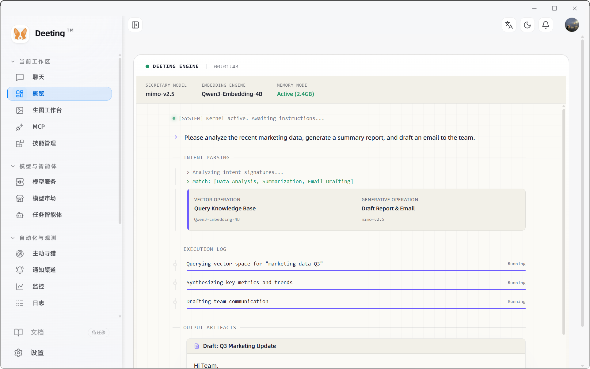
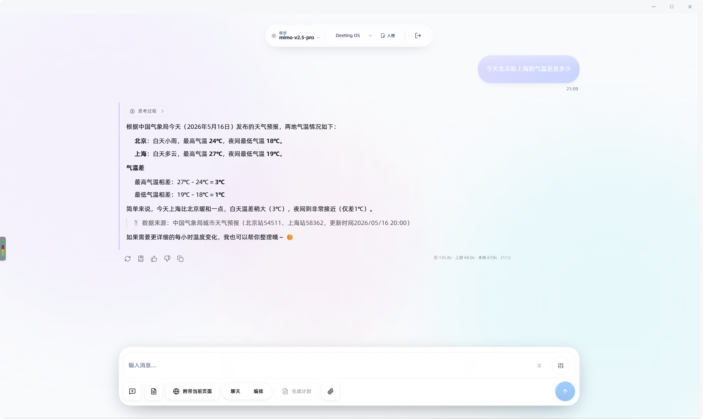
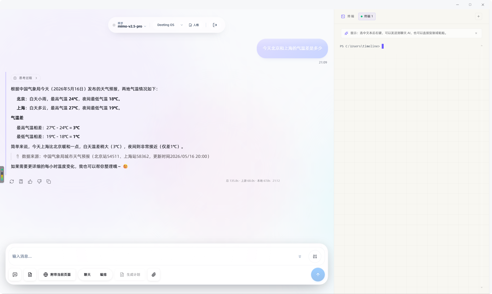

<div align="center">
  
  <h1>Deeting OS (谛听)</h1>
  <p><strong>你的专属 AI 网关与智能上下文枢纽</strong></p>
  <p>Local-First AI Gateway & Context Hub</p>
  <p>
    <a href="https://github.com/MarshallEriksen-Neura/Deeting/releases">下载最新版</a>
    ·
    <a href="./README.en.md">English README</a>
    ·
    <a href="./docs/macos-installation.md">macOS 安装说明</a>
    ·
    <a href="./docs/rag-architecture.md">RAG 架构</a>
    ·
    <a href="./docs/self-evolution-architecture.md">自进化架构</a>
    ·
    <a href="./docs/agent-dag-architecture.md">Agent DAG 架构</a>
    ·
    <a href="./docs/tool-architecture.md">工具封装架构</a>
    ·
    <a href="./docs/memory-architecture.md">记忆系统</a>
    ·
    <a href="./docs/security-architecture.md">安全策略</a>
    ·
    <a href="./docs/bandit-architecture.md">Bandit 架构</a>
    ·
    <a href="./docs/dual-plane-architecture.md">双 Plane 执行</a>
    ·
    <a href="#快速开始">快速开始</a>
  </p>
</div>

<p align="center">
  
</p>

<p align="center">
  
  
  
  
  
</p>

Deeting OS 是一个本地优先的桌面 AI 工作台。它把 AI 对话、工具调用、知识检索、记忆沉淀、终端上下文、Island 交互与 IM 协同收拢到同一个 runtime 下，让桌面端本身成为 AI 的工作现场。

<p align="center">
  
</p>

## Deeting 是什么

- 桌面端与 AI 对话，AI 同时接入本地知识、历史记忆、工具能力、文档资产和终端上下文。
- 一次性回答可以沉淀成技能、知识条目、工作模版和协作入口，下次直接复用。
- 模型配置、知识资产、工具执行都留在本机，桌面端本身就是运行时。

## 它解决什么问题

现有 AI 产品的几个常见缺口：

- 模型看不到本机当前的真实上下文。
- 有价值的信息散落在聊天记录、文件夹、文档、群聊和终端，无法沉淀。
- 工具调用和工作流是一次性的，下一次仍要重新解释。
- IM 协同、工具调用、本地执行、知识检索分散在多个系统里，缺少统一入口。

Deeting 把这些边界收回桌面端处理。

<p align="center">
  
</p>

<p align="center"><em>核心上下文留在桌面端，远端只承担最小必要的补充。</em></p>

## 核心能力

### 1. 本地优先的桌面 AI 工作台

基于 `Next.js 16 + React 19 + Tauri 2 + Rust` 构建。桌面端承接 AI 对话、工具路由、运行时编排和本地能力接入，同时保留现代 Web UI 的灵活性。

<p align="center">
  
</p>

<p align="center"><em>主聊天工作台：对话、工具、知识、记忆、终端在同一现场协作。</em></p>

### 2. AI Gateway 与运行时编排

Rust 后端拆出 `desktop_runtime`、`execution`、`skills`、`mcp`、`providers`、`workflow` 等模块,承接工具调用、技能执行、模型路由和本地编排。

### 3. 终端上下文进入聊天链路

聊天页面接入真实终端。请求级附带 terminal context，由模型按需读取。协议层支持命令边界、上下文快照、右键发送到 AI。

<p align="center">
  
</p>

<p align="center"><em>聊天与终端共享同一上下文，模型直接看到 shell 现场。</em></p>

### 4. 本地知识与 LLM Wiki

支持本地知识资产管理、索引与检索。独立 `llm_wiki` 模块负责本地语义知识工作流，包含 corpus、automation、watcher、maintenance 等链路。适合把零散文档、笔记、资料和项目知识组织成可长期检索的本地知识库。

### 5. 记忆系统

长期 memory 存储、搜索、快照和回滚。聊天历史与记忆解耦，适合长期使用的个人 AI。

### 6. 灵动岛 / Island 交互层

- Chat 路由挂载 `IslandShell`；Tauri 侧预创建独立 `island` 窗口，支持隐藏/显示、尺寸切换、位置控制和全局快捷键唤起。
- 承接状态提示、快捷动作、审批、选中文本动作和对话回流。
- 划词后可直接在 Island 触发 `翻译 / 解释 / 总结 / 提问 / 搜索 / 复制`。
- 翻译为实装能力：快速翻译、目标语言选择、最近目标语言记忆，手动打开时优先读取剪贴板文本作为翻译种子。

<p align="center">
  
</p>

<p align="center"><em>Island 是常驻桌面的轻交互入口。</em></p>

<p align="center">
  
</p>

<p align="center"><em>翻译能力已接入 Island，不必回到完整 chat runtime。</em></p>

### 7. 浏览器执行面

- 独立 Chrome 扩展位于 `packages/deeting_chrome/`：桌面 AI 做决策，扩展做受控的浏览器侧执行。
- 通过 localhost WebSocket bridge 与桌面端连接。
- 能力覆盖：连接桌面端、打开标签页、读取结构化页面快照、执行受限的点击 / 输入 / 滚动动作、对高风险动作走审批。

<p align="center">
  
</p>

<p align="center"><em>扩展侧负责连接当前页面、发起 Ask Current Page / Search Wiki / Search Memory。</em></p>

<p align="center">
  
</p>

<p align="center"><em>浏览器侧结果回流到桌面端 Island，再决定是否带入聊天工作台。</em></p>

### 8. 兼容式扩展能力

保留 `packages/`、`skills`、`mcp` 扩展面，优先复用已有生态，不强制自有插件协议。

### 9. 本地执行与沙箱

内置 BoxLite 侧车与 sandbox 模块，承接代码执行、文档生成、工具链编排等场景。

### 10. IM 协同入口

IM 模块覆盖 Feishu、Telegram、WeChat。桌面端不暴露公网，`deeting-relay/` 提供 relay 边界。桌面端做执行，IM 做触达。

## 真实使用场景

### 场景 1：一边对话，一边带着终端上下文排查问题

本地跑项目、看日志、执行命令时，问题不只在报错文本里，还在 shell 状态、最近几条命令、输出结果和工作目录里。Deeting 让聊天链路直接接到 terminal context，AI 看到的是当前桌面现场的上下文快照，而不是手工复制的一小段错误。主窗口失焦时，Island 接住终端相关的状态、动作和对话入口。

### 场景 2：主窗口不在前台时，仍然处理审批、划词和快捷回复

Island 承接 recent messages、pending approval、selection context、browser lookup 和 quick reply 等轻交互状态。选中一段文本后可以直接从 Island 触发 `翻译 / 解释 / 总结 / 提问 / 搜索 / 复制`，不需要切回主工作台再组织 prompt。

<p align="center">
  
</p>

<p align="center"><em>划词动作带把翻译、解释、总结、提问、搜索、复制贴到当前阅读现场。</em></p>

### 场景 3：把零散资料沉淀成长期可检索的本地知识系统

项目文档、会议记录、技术笔记、研究资料、截图说明散落在不同目录和工具里。knowledge、memory 与 `llm_wiki` 协同工作：摄入 → 整理 → 检索 → 复用。下次回来不需要从零解释上下文。

### 场景 4：桌面端负责真实执行，IM 只是外部触达入口

团队希望 AI 能从飞书或其他 IM 被触达，但模型配置、知识资产、工具执行和本地环境不宜暴露在公网回调面上。IM 事件先进入 `deeting-relay`，桌面端拉取并执行，再回传结果。桌面端持有运行时和上下文，IM 是协同入口。

## 架构概览

### 1. 桌面端是真实运行时

主应用位于 `deeting/`。前端负责界面，Tauri + Rust 承担运行时。`deeting/src-tauri/src/modules/` 拆出 `desktop_runtime`、`execution`、`terminal`、`knowledge`、`memory`、`llm_wiki`、`skills`、`mcp`、`providers`、`workflow`、`sandbox` 等模块，共同承担模型调用、工具路由、执行控制、状态持有、知识检索、扩展接入。Chat、terminal、knowledge、memory 共享同一上下文系统，全部汇入桌面 runtime 链路。

### 2. 接入面环绕桌面 runtime

- **Island**（`IslandShell` + 独立窗口 + 全局快捷键）：桌面表面层，承接状态提示、快捷回复、审批处理、选中文本动作。
- **浏览器执行面**（`packages/deeting_chrome/`）：桌面 AI 是 decision surface，扩展是 bounded browser execution surface。读页面、做动作、回传结果。
- **IM 入口**（`deeting-relay/`）：外部消息进入 relay 边界，桌面端拉取后再消费。

三条接入链路共用同一 runtime，桌面端始终是上下文中心。

### 3. 扩展面保持开放

`skills` / `mcp` 模块、`packages/` 扩展面、本地执行与 sandbox 共同构成可扩展底座，优先兼容已有生态。

<p align="center">
  
</p>

<p align="center"><em>反馈回写让路由贴近真实使用偏好。</em></p>

> 📖 RAG / 上下文编排子系统（Context Orchestrator、三大检索源、context 工具、No Double Lifecycle Rule、selected knowledge 兜底链路）详见 [docs/rag-architecture.md](./docs/rag-architecture.md)。
>
> 📖 自进化 / 自调整子系统（Sovereign Charter、TaskFingerprint、6 个决策点、先验半衰减、Bandit 平局拆解、Posterior Signal、Ingress 边界）详见 [docs/self-evolution-architecture.md](./docs/self-evolution-architecture.md)。
>
> 📖 Agent DAG 执行模型（4 类节点 / 11 状态、execution graph 持久化、Approval Gate 闸门、Direct/Worker 双 plane、In-Flight Stage 三层状态机、跨进程恢复链路）详见 [docs/agent-dag-architecture.md](./docs/agent-dag-architecture.md)。
>
> 📖 工具封装架构（tool catalog 模型可见工具面、capability registry / `search_sdk` 能力总表、`SKILL.md` / `llm-tool.yaml` 双轨封装、skill / MCP / shell 统一执行与审批边界）详见 [docs/tool-architecture.md](./docs/tool-architecture.md)。
>
> 📖 记忆系统（多源写入、Write Guard 三档决策、Supersession 取代语义、6 种衰减 profile、Vitality 活力值、Fact Extractor 长期事实抽取、Snapshot 审计）详见 [docs/memory-architecture.md](./docs/memory-architecture.md)。
>
> 📖 安全策略（三维度风险模型、operation × target × boundary 分类、Approval Gate、SessionApprovalGrant 会话级授权、BoxLite 沙箱多后端、敏感路径与内网防御）详见 [docs/security-architecture.md](./docs/security-architecture.md)。
>
> 📖 Bandit 多臂老虎机（Thompson / UCB / ε-greedy 三策略、路由 / Worker 选择 / 记忆召回三场景、ROUTE_BANDIT_COEFF 平局拆解、Cooldown 故障保护、与 Python 实现位级对齐）详见 [docs/bandit-architecture.md](./docs/bandit-architecture.md)。
>
> 📖 双 Plane 执行架构（Direct / Worker 双模、共享 8 步编排流水线、RouteSelectionStep 决策、安全锁清单、Worker 自动委派 vs 模型主动 delegate_task、Workflow 引擎路径、delegated_result envelope）详见 [docs/dual-plane-architecture.md](./docs/dual-plane-architecture.md)。

## 一个更真实的工作流

1. 在桌面端发起对话或任务。
2. Deeting 按需引入本地知识、记忆、工具能力、终端上下文或文档资产。
3. 桌面 runtime 负责模型调用、工具编排、执行和结果回流。
4. 有价值的结果沉淀为知识、记忆、模版或可复用工作流。

<p align="center">
  
</p>

## 适合谁

- 希望 AI 真正接入本地工作环境的个人开发者或重度桌面用户。
- 希望把知识、记忆、工具和会话统一到一个工作台里的 AI 产品探索者。
- 想要扩展技能、文档生成、知识检索或 IM 协同能力的构建者。
- 希望把 AI 做成真正桌面工作站的团队。

## 快速开始

### 安装

从 [GitHub Releases](https://github.com/MarshallEriksen-Neura/Deeting/releases) 下载最新版本。

#### Windows

下载 `Deeting Setup_x.x.x_x64-bootstrapper.exe`，运行图形化安装器。

#### macOS

项目当前未做 Apple 公证签名，首次打开需要额外确认。详见 [macOS 安装说明](./docs/macos-installation.md)。

#### Linux

下载 `.deb` 或 `.AppImage`，按常规方式安装。

### 首次启动前你需要准备

1. 本机具备 `Python 3` 与 `Node.js` 环境。
2. 至少一个可用的模型服务配置。
3. 至少一个 embedding 模型，用于知识 / 记忆相关能力。

### 首次启动建议顺序

1. 安装并打开 Deeting。
2. 进入 dashboard，配置 AI 服务。
3. 在模型页拉取或同步一次模型列表。
4. 在设置页完成 agent 运行检测。
5. 配置桌面秘书模型与 embedding 模型。
6. 设置 Island 唤起快捷键以及关闭主窗口后的行为。
7. 开始使用 chat、knowledge、memory、Island 等能力。

## 开发

主桌面应用位于 [`deeting/`](./deeting/)。

### 启动前端开发环境

```bash
cd deeting
bun install
bun run dev
```

### 启动桌面开发环境

```bash
cd deeting
bun install
bun run desktop:dev
```

### 构建桌面应用

```bash
cd deeting
bun run desktop:build
```

`deeting/scripts/tauri-with-protoc.mjs` 会在启动 Tauri 命令时自动处理 `PROTOC` 检测与注入。

## 仓库结构

```text
.
├─ deeting/           # 主桌面应用（Next.js + Tauri + Rust）
├─ deeting_core/      # 核心后端/任务与测试资产
├─ deeting-relay/     # IM relay 服务，作为公网 ingress 边界
├─ installer/         # Windows 图形化安装器
├─ scout/             # 独立侦察/抓取微服务
├─ packages/          # 扩展相关模板、SDK 与兼容资产
│  └─ deeting_chrome/ # Chrome 浏览器执行面扩展
├─ docs/              # 文档与 README 配图
└─ scripts/           # 辅助脚本
```

核心目录：

- [`deeting/`](./deeting/)：主产品入口，前端界面、Tauri 壳层和 Rust 模块。
- [`deeting-relay/`](./deeting-relay/)：飞书等 IM 回调进入 relay，再由桌面端消费执行。
- [`packages/`](./packages/)：扩展相关模板、SDK 与兼容资产。
- [`packages/deeting_chrome/`](./packages/deeting_chrome/)：浏览器执行面扩展。
- [`scout/`](./scout/)：网页侦察、抓取与深度 crawling 服务。

## 仓库内已经存在的关键能力域

`deeting/src-tauri/src/modules/` 当前已包含：

- `desktop_runtime`
- `execution`
- `terminal`
- `knowledge`
- `memory`
- `llm_wiki`
- `skills`
- `mcp`
- `providers`
- `workflow`
- `generated_files`
- `image_generation`
- `im`
- `sandbox`

> 📖 `desktop_runtime/context_orchestrator/` + `knowledge` + `memory` + `llm_wiki` + `retrieval_kernel` 共同构成本地 RAG / 上下文编排子系统，独立文档见 [docs/rag-architecture.md](./docs/rag-architecture.md)。

## 子项目说明

### `deeting-relay`

轻量 relay 服务，承接飞书等 IM 的公网回调，再转交给本地桌面端执行。

### `scout`

独立侦察微服务，负责网页抓取、反爬对抗和深度 crawling，适合外部知识摄取。

### `packages`

扩展相关工具箱，包含 SDK、模板和兼容资产。

### `installer`

Windows 图形化安装器，把主应用以友好的安装路径交付给最终用户。

## Star History

<a href="https://www.star-history.com/?repos=MarshallEriksen-Neura%2FDeeting&type=date&legend=top-left">
 <picture>
   <source media="(prefers-color-scheme: dark)" srcset="https://api.star-history.com/image?repos=MarshallEriksen-Neura/Deeting&type=date&theme=dark&legend=top-left" />
   <source media="(prefers-color-scheme: light)" srcset="https://api.star-history.com/image?repos=MarshallEriksen-Neura/Deeting&type=date&legend=top-left" />
   
 </picture>
</a>

## 社区与更新

认同 `真诚`、`友善`、`团结`、`专业`，欢迎加入 [LinuxDo](https://linux.do/latest)。

Deeting 进展持续更新在：[Deeting 更新说明 / 讨论帖](https://linux.do/t/topic/2070886)

