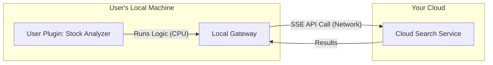

# Deeting AI OS: Plugin Runtime & Execution Strategy

## 1. Core Philosophy: "Hybrid Runtime"
To balance **User Creativity** (Local) with **Server Stability** (Cloud), we enforce a strict separation of execution environments based on the `runtime` policy.

*   **Cloud Runtime (SaaS)**: Stability-first. Only runs Official/System plugins. No arbitrary user code execution to prevent resource abuse.
*   **Local Runtime (Edge)**: Freedom-first. Runs ANY plugin. Users utilize their own hardware (CPU/RAM) to execute logic, ensuring privacy and unlimited creativity.

---

## 2. Runtime Zones

| Zone | Environment | Allowed Plugins | Resource Cost | Example |
| :--- | :--- | :--- | :--- | :--- |
| **Zone A: Cloud** | Your Servers (SaaS) | `System` + `Official` | Paid by You | Official Search, User Auth, Billing |
| **Zone B: Local** | User's Device (Gateway) | `All` (System + User + 3rd Party) | Paid by User | Home Automation, Local RAG, Crypto Ticker |
| **Zone C: Browser**| User's Browser (JS) | `Frontend-only` | Paid by User Device | UI Widgets, Client-side logic |

---

## 3. Architecture Design

### 3.1 Manifest Field (`kimai.json`)
Plugins must explicitly declare supported runtimes.

```json
{
  "name": "my-local-tool",
  "runtime": ["local"], // Cannot be installed on Cloud SaaS
  "dependencies": ["mcp.local_fs"]
}
```

```json
{
  "name": "official-weather",
  "runtime": ["cloud", "local"], // Universal
  "dependencies": ["mcp.search_web"]
}
```

### 3.2 Gateway Scheduling Logic
The Gateway Kernel acts as the gatekeeper based on its deployment mode.

*   **Mode: CLOUD_HOSTED**
    *   **Registry Filter**: Only shows plugins with `"cloud" in runtime`.
    *   **Security**: Sandbox execution (WebAssembly/Serverless) with strict timeouts (5s) and RAM limits (128MB).
    *   **Permissions**: Deny all `fs`, `shell` access.

*   **Mode: LOCAL_SELF_HOSTED**
    *   **Registry Filter**: Shows ALL plugins.
    *   **Security**: Docker/Subprocess isolation.
    *   **Permissions**: User grants specific scopes (`fs`, `docker`) during installation.
    *   **Connectivity**: Can still call Cloud MCP APIs (Search) via SSE if API Key is provided.

---

## 4. MCP Interaction (The "Remote Control" Model)

Even when a plugin runs **Locally**, it can leverage **Cloud Capabilities**.



*   **Compute**: Logic runs locally (Free for you).
*   **Capability**: Search/Crawl runs on Cloud (Monetizable API).

---

## 5. Deployment Strategy

### Phase 1: The "Clean Cut" (MVP)
*   **Cloud SaaS**: Users can ONLY use built-in Official Plugins. No custom plugin installation allowed.
*   **Local Gateway**: Users can install anything from the Registry.

### Phase 2: The "Serverless Sandbox" (Future)
*   Allow Premium Users to deploy custom plugins to Cloud.
*   Execute these plugins in isolated `Firecracker MicroVMs` or `WASM` containers.
*   Charge based on execution time (ms).

---

## 6. Summary for Engineers
1.  **Do not** build a generic Python runner on the Cloud backend yet. It's a security nightmare.
2.  **Focus on** the Local Gateway as the primary runtime for user extensions.
3.  **Monetize** the *Cloud MCP APIs* (Search, Deep Crawl), not the *Plugin Hosting*.
