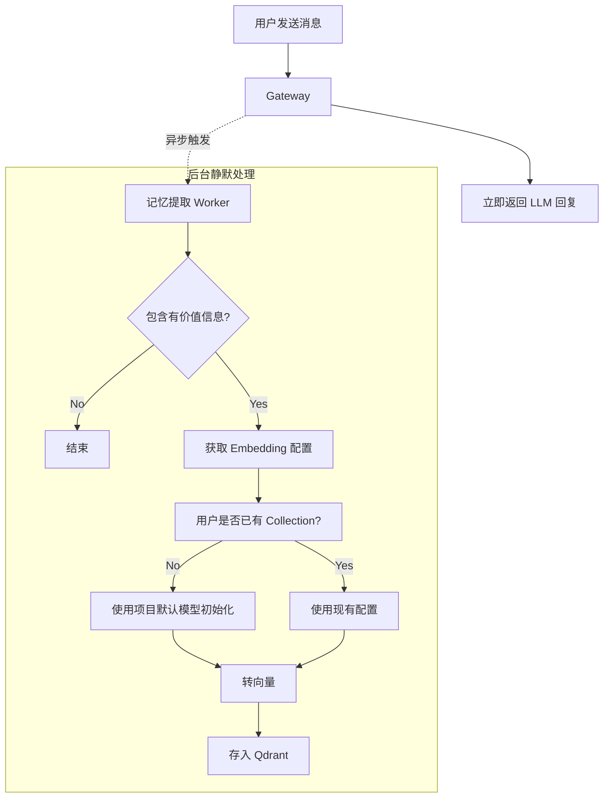

# 知识库（Qdrant）全局集成规划（系统维度 + 用户维度）

本文档用于从**全局架构**视角规划 Qdrant + AI 的深度集成：核心模式为**聊天即记忆（Chat-as-Memory）**——不依赖“用户上传文档→再去检索”的传统 RAG 工作流，而是从用户每次对话内容中提炼出“值得长期保存/可复用”的记忆单元，并按**system / user** 两个维度治理；同时为后续的语义缓存、动态 Few-shot、语义风控、离线增强等能力打基础。

> 核心原则：**默认不检索**。对大多数请求（例如“你好/早安/写个脚本”）不应触发 embedding/Qdrant 搜索，避免资源浪费与上下文污染；只有命中特定条件才进入检索链路。

---

## 0. 当前落地状态（Implementation Status，已实现）

> 截至 2026-01-02：本仓库已实现“写入 + 读取”最小闭环，并把关键决策锁定为 **全平台统一 embedding + 单一大集合（shared）+ 强制隔离 filter**。

### 0.1 核心决策（MVP 锁定）
- **Embedding 全局统一**：由 `KB_GLOBAL_EMBEDDING_LOGICAL_MODEL` 指定；在 `QDRANT_KB_USER_COLLECTION_STRATEGY=shared` 下该值必须配置，避免“维度地狱”。
- **user 维度单一大集合**：默认 `kb_shared_v1`（可通过 `QDRANT_KB_USER_SHARED_COLLECTION` 改名），以 payload 逻辑隔离（`owner_user_id` + `project_id` 强制 must filter）。
- **named vector 固定**：向量名固定为 `text`（代码内置），不再通过环境变量手填维度；维度由 embedding 结果长度决定。

### 0.2 已实现的关键能力（读写闭环）
- **Write（旁路异步 + 增量游标）**：Celery 任务 `tasks.extract_chat_memory`，idle 5 分钟触发；采用 `Conversation.last_memory_extracted_sequence` 做 DB 游标增量抽取，并用“尾递归自派发”追赶积压：`backend/app/tasks/chat_memory.py`。
- **Read（按需检索注入 + 智能改写）**：聊天主链路 best-effort 检索并注入 system message（有 gating）。支持 **LLM Query 改写** 处理代词消解与上下文补全：`backend/app/services/chat_memory_retrieval.py`。
- **检索质量治理**：引入 `MIN_SCORE_THRESHOLD=0.75`、内容哈希去重及动态 Top-K 策略，确保 RAG 召回精度。
- **结构化属性（确定性存储）**：路由模型输出 `structured_ops`（UPSERT），具备 **Key 白名单与 Schema 校验**，落库 `kb_attributes`（Postgres）：`backend/app/services/kb_attribute_schema.py`、`backend/app/repositories/kb_attribute_repository.py`。
- **治理与 API 闭环**：
    - **用户侧**：支持列表、删除、导出个人记忆：`backend/app/api/v1/user_memory_routes.py`。
    - **管理侧**：支持 System 候选条目审核、修正发布及手动创建：`backend/app/api/v1/admin_memory_routes.py`。
- **灰测与监控**：`POST /v1/projects/{project_id}/memory-route/dry-run` + `apiproxy.memory_debug` 专项日志。

### 0.3 代码落点速查
- Qdrant Client：`backend/app/qdrant_client.py`
- Qdrant store（create/upsert/search/scroll/delete）：`backend/app/storage/qdrant_kb_store.py`
- collection 命名与策略：`backend/app/storage/qdrant_kb_collections.py`
- system collection bootstrap：`backend/app/services/qdrant_bootstrap_service.py`
- embedding 统一调用：`backend/app/services/embedding_service.py`
- 记忆路由与改写：`backend/app/services/chat_memory_router.py` + `backend/app/services/chat_memory_retrieval.py`
- 结构化校验：`backend/app/services/kb_attribute_schema.py`
- API 接口：`backend/app/api/v1/user_memory_routes.py` + `backend/app/api/v1/admin_memory_routes.py`

---

## 1. 目标与非目标

### 1.1 目标
- 引入“**系统记忆**（system）”与“**用户记忆**（user）”两种维度的向量化存储与检索（记忆单元来自聊天内容的提炼，而非以文档上传为主）。
- 支持按需启用：语义缓存、记忆检索（Memory Retrieval）、动态 Few-shot、语义风控（Guardrails）。
- 建立离线管道：从对话中抽取“事实/偏好/约束/待办/结论”等记忆单元，去重/脱敏后写入；以及基于证据的“规则/元数据增强”（AI 离线生成结构化规则）。
- 全链路可灰度、可审计、可回滚、可熔断降级到“直连主模型”。

### 1.2 非目标（阶段性不做/不强依赖）
- 不做“每次请求都检索”的无脑 RAG。
- 不把 AI 作为在线裁判来决定必填字段/敏感规则；在线决策必须基于结构化规则与显式阈值。
- 不以“用户上传文档→切分→检索”为主流程（可作为后续补充能力，但不作为当前系统架构的核心路径）。

---

## 2. 总体架构：控制面（Control Plane）与数据面（Data Plane）

### 2.1 数据面：每次请求的快路径（必须稳定、可降级）
建议的执行顺序（均需开关与阈值控制）：
1) **语义风控（可选）**：仅在“疑似越狱/敏感/违规”触发快速检索或分类；否则跳过。
2) **语义缓存（推荐优先）**：高相似度命中直接返回历史答案，显著降成本/提速。
3) **轻量路由判定（可选）**：判断是否需要 RAG / few-shot / 记忆（输出结构化决策，失败则直接跳过）。
4) **（必要时）Query 改写 + 记忆检索**：改写补全指代词（它/那个/上次）后再检索，避免召回失败。
5) **上下文组装**：严格 token 预算与去噪，避免“检索污染”。
6) **主模型生成**：拿到“必要上下文”即可，不强行塞满。
7) **异步写入（核心）**：把“值得记忆/可缓存/可复用的精华”送入离线管道（聊天即记忆的主入口）。

#### 2.1.1 旁路异步：不阻塞聊天回复（推荐落地形态）
建议将“记忆提取 + embedding + Qdrant upsert”作为 **Celery 旁路任务**，避免任何额外延迟影响用户拿到回复。



仓库内已落地的代码入口（旁路触发点）：
- `backend/app/tasks/chat_run.py`：在 baseline run 完成后入队 `tasks.extract_chat_memory`（延迟触发）。
- `backend/app/tasks/chat_memory.py`：执行“抽取→embedding→ensure_collection_ready→upsert”的后台任务（best-effort）。

### 2.2 控制面：慢路径（配置、审核、评估、离线任务）
控制面负责：
- 开关与灰度：哪些用户/项目启用哪些能力（缓存/检索/few-shot/风控）。
- 阈值与策略：相似度阈值、top-k、token 预算、TTL、熔断参数。
- 审核与回滚：尤其是“从用户维度提升到 system 维度”的内容，建议默认需人工确认。
- 离线任务编排：利用现有异步任务体系（例如 Celery）做 ingestion / 总结 / 增强。

---

## 3. “系统维度 + 用户维度”数据策略

### 3.1 两个维度的定义
- **system 维度**：全局通用的“系统记忆/经验规则”（来自多用户对话中可复用的结论，经脱敏 + 泛化 + 审核后发布）。
- **user 维度**：只对当前用户可见的“个人记忆”（偏好、个人事实、项目上下文、长期约束、待办等）。

### 3.2 检索范围（读策略）
- 用户在聊天时的检索范围：`user + system`
  - `user`：必须严格过滤 `owner_user_id == 当前用户`
  - `system`：无需 owner 过滤，但必须是已审核/允许公开的内容

> 后续若需要团队共享，可扩展 `project` 维度（同项目共享、比 system 更私密），但本规划以 user+system 为主。

### 3.3 写入策略（写策略）

#### user 维度（可自动写入，但要“只存精华”）
聊天即记忆的核心在这里：**不把每句话写入向量库**，而是把“可复用/可召回”的结构化记忆写入。
- 触发条件建议（可组合）：
  - 用户显式指令（例如“记住：……”）
  - 会话增量摘要成功后（对摘要/增量片段做二次抽取）
  - 达到 N 轮对话 / 话题切换 / 长文本输入后
  - 关键字段出现（偏好/约束/时间地点/账号信息等——需要和脱敏策略联动）
- 写入内容建议（拟新增 memory_type）：
  - **事实（fact）**：用户的长期事实、项目背景、已确认结论
  - **偏好（preference）**：风格、语言、格式、禁忌点
  - **约束（constraint）**：必须/禁止、兼容性要求、环境约束
  - **待办（todo）**：明确的任务、后续行动
  - **长期上下文摘要（summary）**：当事实不足以覆盖但又需要持续携带时
- 去重与 TTL 分层：
  - 新鲜度高但可能变化的（例如“当前在做 X”）用短 TTL
  - 稳定偏好/长期事实用长 TTL 或显式用户确认后永久

#### system 维度（默认不自动写入，需“脱敏+泛化+审核”）
system 维度的写入必须走管道：
1) **抽取**：从 user 维度内容里抽取“可复用知识点”
2) **脱敏**：去掉姓名/手机号/邮箱/地址/账号/内部链接/密钥/项目代号等
3) **泛化改写**：把“某用户的具体案例”改写成“通用可复用的经验/步骤”
4) **证据绑定**：保留来源引用（但不在 system 内容中泄露隐私）
5) **审核发布**：建议默认人工确认后进入 system（前期尤为重要）

---

## 4. Qdrant 数据模型规划（建议：按用途拆 Collection，避免污染）

为避免“把不相关内容检索出来污染上下文”，建议按用途拆 collection，而不是把所有内容混到一个大库里。

> 注意：以下为“规划 + 现状对齐”的 schema。字段名以仓库现有实现为准，后续扩展需保持兼容与可迁移。

### 4.1 推荐的 Collection 列表（MVP 可先做 2 个）
- `kb_system`：系统通用知识（system）
- `kb_shared_v1`：用户私有记忆（user，**单一大集合**，用 payload 强制隔离；建议带版本号便于迁移）
  - 可通过 `QDRANT_KB_USER_SHARED_COLLECTION` 修改名称
  - 可通过 `QDRANT_KB_USER_COLLECTION_STRATEGY` 切回 `per_user` 或 `sharded_by_model`（非 MVP 默认）
- （可选后续）`semantic_cache`：语义缓存（问答对）
- （可选后续）`fewshot_examples`：动态 Few-shot 示例库
- （可选后续）`guardrails_intents`：语义风控样本库

### 4.2 通用 Payload（建议字段）
所有 points 建议带以下 payload 以便过滤与审计：
```json
{
  "scope": "system|user",
  "approved": true,
  "owner_user_id": "uuid|null",
  "project_id": "uuid|null",
  "submitted_by_user_id": "uuid|null",
  "source_type": "chat_memory_route",
  "source_id": "conversation_id",
  "text": "string",
  "categories": ["user_profile|preference|project_context|fact"],
  "keywords": ["string"],
  "memory_items": [{"content":"...","category":"...","keywords":["..."]}],
  "embedding_model": "logical_model",
  "created_at": "iso8601"
}
```

过滤规则：
- `kb_shared_v1`：**必须** `must(owner_user_id==当前用户 && project_id==当前项目 && scope=user && approved=true)`（由服务层强制注入，业务层不可绕过）
- `kb_system`：不带 owner，但必须保证只检索 `approved=true`；用户投稿进入 system 时默认 `approved=false`，需要审核发布

补充说明（collection 拆分策略取舍）：
- shared（当前 MVP 默认）：运维最省（collection 数固定），但必须“焊死” filter（`owner_user_id`+`project_id`）避免串读。
- per_user（可选）：权限边界更直观、用户级删除更简单（drop collection），代价是 collection 数随用户增长，运维成本更高。

向量字段约定（避免“向量名称/维度”在环境变量里漂移）：
- 统一使用 **named vector**，向量名固定为 `text`（由后端代码内置，不通过环境变量配置）。
- 向量维度不通过环境变量手填：由 embedding 结果长度决定；system collection 在启动时尝试从已有用户库推断维度，若无法推断则在首次成功 embedding 后自动补齐创建。

---

## 5. 离线管道（Ingestion / 总结 / 增强）

### 5.1 聊天即记忆：对话记忆提炼（user 维度，核心链路）
推荐从“会话摘要/增量摘要”作为入口，而不是逐句写入：
- 输入：
  - 近期 N 轮对话的增量 transcript（或现有会话摘要 service 的 delta 输出）
  - 用户显式“记住”指令片段（高优先级）
- 处理（建议两段式，便于降级与观测）：
  1) **抽取**：把对话内容转成候选记忆单元（fact/preference/constraint/todo/summary）
  2) **治理**：去重、合并冲突、TTL 判定、敏感信息处理（与内容脱敏策略保持一致）
  3) **落库**：写入 `kb_user_<user_id>`（并在关系库中留审计索引，便于列表/删除/导出）
- 输出：
  - 可检索的记忆单元（chunk）+ 绑定来源（conversation_id、message_ids、时间戳等，拟新增审计字段）

触发策略（Trigger Policy，先做简单可靠的版本）：
- **idle 5 分钟**后触发一次“增量游标”提取（避免每句话都存，同时保证不漏消息）：
  - 游标字段：`Conversation.last_memory_extracted_sequence`
  - 增量切片：`(cursor, until_sequence]`，按序处理，批大小 `_BATCH_LIMIT`
  - 积压追赶：批满时采用“尾递归自派发”继续处理下一批（避免单 task while 跑完）
  - 上下文背景：把 `Conversation.summary_text` 拼到 transcript 顶部作为背景（替代 overlap 窗口）
- 记忆路由模型建议使用“低成本 chat 逻辑模型”（由项目设置 `kb_memory_router_logical_model` 决定，避免写死）。
- 路由模型输出结构化决策：是否存储、存储到 `user` 还是 `system`。
- 只有当路由决策为 should_store=true 且 memory_text 非空时才会做 embedding 与写入 Qdrant。

### 5.2 用户内容“提升到 system”的发布流程
- 输入：候选 user 记忆/文档片段
- 处理：脱敏 → 泛化 → 生成 system 版本 → 进入审核队列
- 输出：通过审核后写入 `kb_system`（并带审计信息）

### 5.3 规则/元数据增强（AI 作为“离线增强器”，不是在线裁判）
- 输入：历史错误样例、已确认的结论、system 记忆（可存入 Qdrant 作为 evidence）
- 处理：AI + evidence 检索 → 生成结构化规则（例如 required_fields、supported_formats、limits…）
- 输出：写入数据库中的结构化字段（需 schema 校验 + 版本化 + 回滚）

---

## 6. 灰度、熔断与评估指标

### 6.1 灰度开关
- 按用户级别开启：仅对部分用户打开（尤其是 user 维度记忆与 system 发布）
- system 发布必须有独立开关与审批流程

### 6.2 熔断降级
- Qdrant 不可用 / embedding 失败 / 路由模型超时：自动跳过检索链路，直连主模型
- 缓存命中失败不会影响主流程

### 6.3 指标（必须观测）
- 检索触发率（应低）
- 语义缓存命中率、节省的上游调用次数/成本
- P50/P95 延迟增量
- system 发布审核通过率、误脱敏率（抽样评估）
- 用户可控性：记忆命中率、删除/导出成功率

---

## 7. 里程碑建议（MVP → 扩展）

### Phase 1（MVP）[DONE]
- `kb_user` + `kb_system` 两个维度与基础检索（默认不触发）
- 异步“对话→记忆提炼→写入 kb_shared_v1”（聊天即记忆）
- 结构化属性写入与 Key 白名单校验
- 用户/管理侧记忆管理 API (List/Delete/Export/Approve)

### Phase 2 [IN PROGRESS]
- 语义缓存 `semantic_cache`（TODO）
- 路由判定 + **Query 改写**（DONE）
- 检索阈值与去噪（DONE）

### Phase 3
- 动态 few-shot、语义风控、规则/元数据增强全链路治理

---

## 8. 在本仓库落地：Qdrant 接入的“最小闭环”拆解

本节把上面的系统规划映射到当前仓库结构（FastAPI + PostgreSQL + Redis + Celery），用于指导真实落地顺序。

### 8.1 现有可复用落点（不新增路由也能开始）
- 在线聊天入口：`backend/app/api/v1/chat_routes.py`（请求入口）+ `backend/app/api/v1/chat/request_handler.py`（执行协调器）
  - 未来检索增强建议在进入 `try_candidates_*` 之前完成：先做“是否检索”的结构化决策，再决定是否补充 messages。
- 对话摘要：`backend/app/services/conversation_summary_service.py`
  - 可作为“离线记忆提炼”的上游输入（摘要/事实/偏好/待办 → 分 chunk → 写入 kb_user）。
- 异步任务模式参考：`backend/app/tasks/conversation_title.py`
  - 典型做法：`asyncio.run(...)` + `SessionLocal()` + `get_redis_client()` + 任务结束 `close_*_for_current_loop()`。
- 低成本触发判定特征：`backend/app/services/context_features_service.py`
  - 可用于实现“默认不检索”的启发式 gating（例如：task_type=qa 才考虑检索）。

### 8.2 Qdrant 基础设施（已落地到仓库）
- 配置项（后端读取点）：`backend/app/settings.py`
  - `QDRANT_ENABLED` / `QDRANT_URL` / `QDRANT_API_KEY` / `QDRANT_TIMEOUT_SECONDS`
  - `QDRANT_KB_SYSTEM_COLLECTION`
  - `QDRANT_KB_USER_COLLECTION_STRATEGY` / `QDRANT_KB_USER_SHARED_COLLECTION` / `QDRANT_KB_USER_COLLECTION`
  - `KB_GLOBAL_EMBEDDING_LOGICAL_MODEL`（shared 策略必填）
- Docker Compose（开发/镜像两种）：`docker-compose.develop.yml`、`docker-compose.images.yml`
  - 新增 `qdrant` service（HTTP 端口 6333，宿主映射到 `127.0.0.1:16333`）。
- Qdrant 客户端封装：`backend/app/qdrant_client.py`
  - 按 event loop 缓存 client，并提供 `close_qdrant_client_for_current_loop()` 供 Celery/短生命周期 loop 使用。
- Collection 初始化辅助：`backend/app/services/qdrant_collection_service.py`
  - `ensure_collection_ready()`：shared 策略下强制要求全局统一 embedding；并支持传入 `preferred_vector_size` 避免额外探测调用。
- 连通性探测：`backend/app/storage/qdrant_service.py`
  - `qdrant_ping()`：用于未来做健康探测/熔断的最小能力。
 - 记忆检索注入（Read path）：`backend/app/services/chat_memory_retrieval.py`（gating + filter + inject）

### 8.3 MVP（Phase 1）建议的“真实任务清单”（按依赖顺序）
1) Embedding 统一入口（不暴露给前端也可先做内部接口）
   - 目标：给定文本 → 返回向量（并可观测、可超时、可降级）。
   - MVP 约束：**全平台统一 embedding 模型**（由 `KB_GLOBAL_EMBEDDING_LOGICAL_MODEL` 指定）。
2) `kb_user/kb_system` 写入闭环
   - 输入：对话增量（优先走“摘要/增量摘要”入口）+ 用户显式“记住”片段
   - 处理：抽取记忆单元（fact/preference/constraint/todo/summary）→ 脱敏/去重/合并 → TTL 分层
   - 输出：写入 Qdrant
     - user：`kb_shared_v1`（单一大集合；强制 payload 隔离）
     - system：`kb_system`（仅审核发布进入）
     并在 PostgreSQL 留一份索引表用于审计/删除/导出。
3) `kb_user/kb_system` 检索闭环（默认不触发）
   - gating：命中明确条件才检索（例如：QA/“上次/之前/记得吗”/用户开启开关）
   - 检索：top-k + 阈值过滤 + owner 过滤（user）+ 审核过滤（system）
   - 组装：严格 token 预算与去噪（避免检索污染）

### 8.4 推荐的代码模块拆分（便于后续 Phase 2/3 扩展）
建议把“是否检索/怎么检索/怎么写入”拆为三层，避免把逻辑塞进 `RequestHandler`：
- `app/services/embedding_service.py`（已实现）
  - 职责：统一“文本→向量”调用（后续可做批量、缓存、降级）。
- `app/storage/qdrant_kb_store.py`（已实现）
  - 职责：封装 Qdrant 的 upsert/search/delete/scroll/points，负责 payload filter 组装与错误分类。
- `app/services/chat_memory_retrieval.py`（已实现）
  - 职责：gating + **LLM Query 改写** + 强制 filter + 注入 system context。
- `app/repositories/kb_attribute_repository.py`（已实现）
  - 职责：PostgreSQL 侧的结构化属性存储。

### 8.5 降级策略（落地时必须先写清）
...

---

## 9. TODO 与可增强点（按优先级建议）

### 9.1 MVP 后优先做（建议优先级：高）
- [x] 检索 Query 改写（LLM 小模型）：将 `build_retrieval_query()` 升级为基于 LLM 的改写，并保留成本门禁
- [x] 检索阈值与去噪：增加 score 阈值、内容哈希去重、top-k 动态调整，避免检索污染
- [x] system 维度检索：在合适场景注入已审核的 system 记忆（仍保持 default-not-retrieve）
- [x] system 投稿审核/发布闭环：提供“候选列表→审核→发布→拒绝”能力
- [x] 结构化 key 规范化：沉淀 key 白名单并在写入时做校验

### 9.2 平台治理与运维（建议优先级：中）
- [ ] 语义缓存 `semantic_cache`：基于向量匹配的快速回复，显著降成本
- [ ] Qdrant scroll + 批量 backfill 工具：支持迁移/重算 embedding（v1→v2）
- [x] 记忆删除/导出：用户侧“查看/删除/导出我的记忆”（shared 策略下必须支持按 owner filter 删除）
- [ ] 指标与告警：记忆检索触发率、命中率、额外延迟、每会话积压批次数（识别异常/成本暴涨）

### 9.3 体验与智能化（建议优先级：中/低）
- [ ] 记忆去重/合并：同一事实多次出现合并为一条（可用哈希或小模型判等）
- [ ] 记忆 TTL/权重：按类型设置 TTL 与检索权重（偏好/项目规范 > 临时事实）
- [ ] 更精细 gating：更智能的判定是否需要检索的漏斗机制
