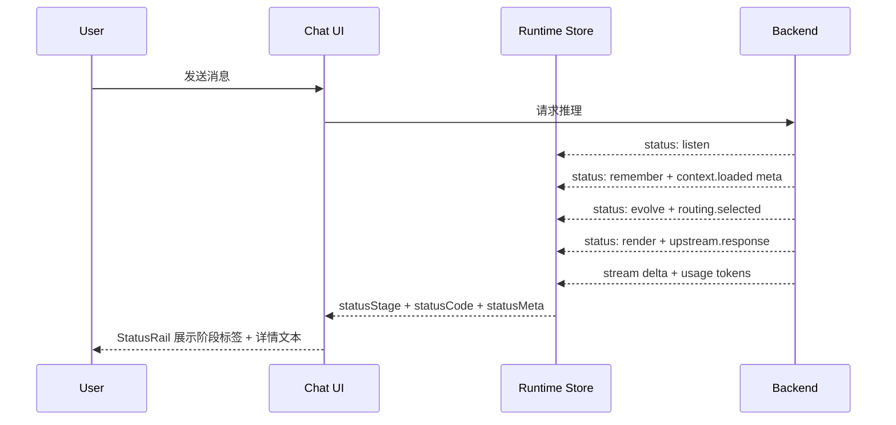
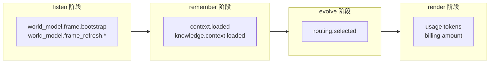
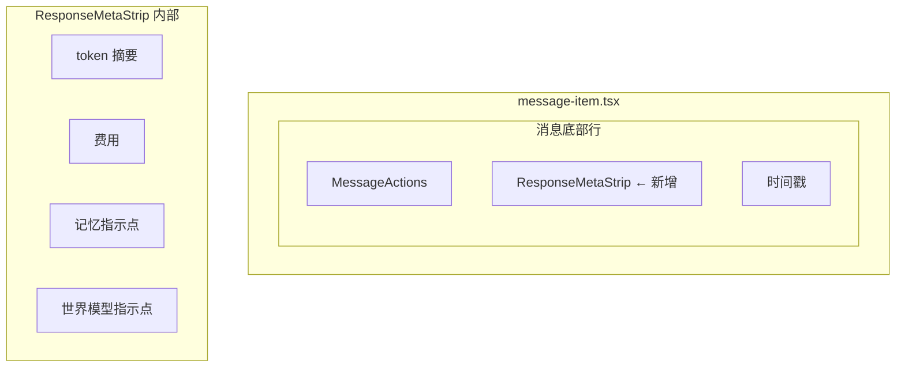
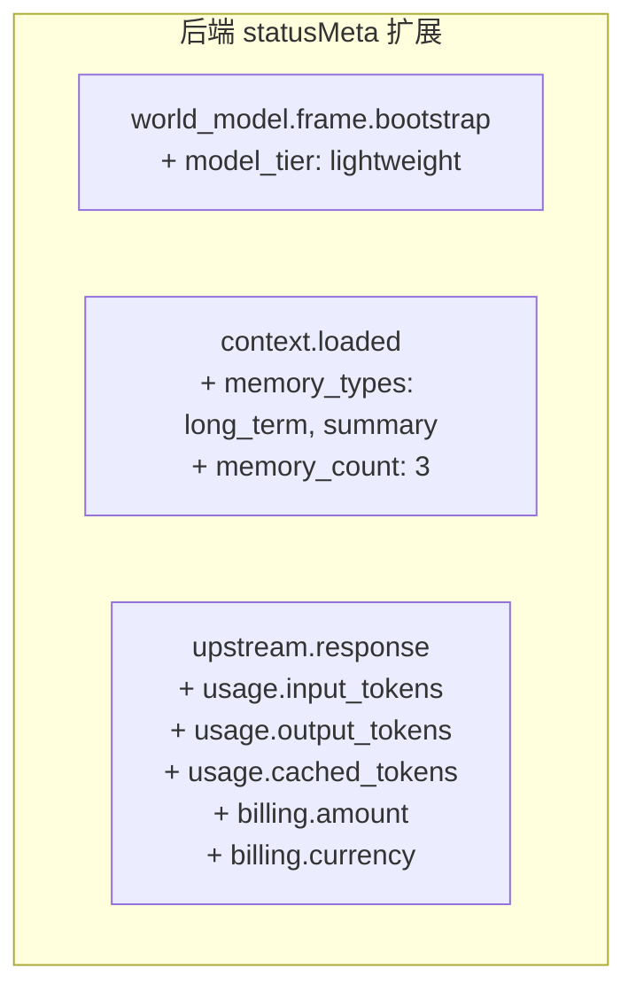
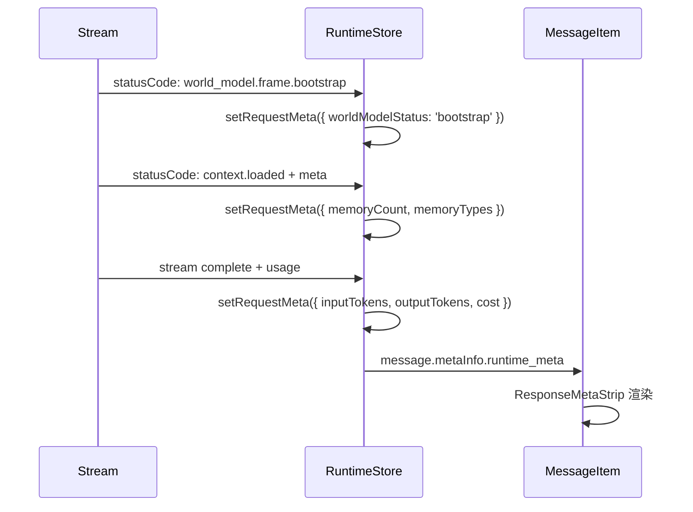

# 前端运行时透明度设计：Token 消耗 / 记忆注入 / 世界模型刷新

## 1. 现状分析

### 1.1 当前信息流



### 1.2 已有基础设施

| 组件 | 文件 | 能力 |
|------|------|------|
| [`AIResponseStatusRail`](deeting/components/chat/messages/ai-response-bubble/status-rail.tsx:154) | status-rail.tsx | 加载中展示 4 阶段流程 + 详情文本 |
| [`AIResponseStreamingTail`](deeting/components/chat/messages/ai-response-bubble/status-rail.tsx:265) | status-rail.tsx | 流式输出时的紧凑状态指示 |
| [`resolveStatusDetail()`](deeting/lib/chat/status-detail.ts:5) | status-detail.ts | 将 statusCode + meta 映射为可读文本 |
| [`extractRuntimeMetrics()`](deeting/components/chat/messages/message-item.tsx:65) | message-item.tsx | 从 metaInfo 提取延迟指标 |
| [`MinimalStatusIndicator`](deeting/components/chat/visuals/status-visuals.tsx:89) | status-visuals.tsx | 通用加载指示器 |
| Token usage 解析 | chat.ts:285-341 | 仅在 Tauri 本地记录 gateway log，不展示 |

### 1.3 三类信息的生命周期位置



- **世界模型刷新**：发生在 `listen` 阶段，statusCode 为 `world_model.frame.bootstrap` / `world_model.frame_refresh.*`
- **记忆注入**：发生在 `remember` 阶段，statusCode 为 `context.loaded`，meta 含 `count`、`has_summary`
- **Token 消耗**：在流式响应结束时通过 `usage` 字段返回，目前仅写入本地 log

---

## 2. 设计原则

1. **渐进式披露**：默认只展示一行摘要，点击/hover 展开详情
2. **不打断阅读流**：信息附着在已有 UI 元素上，不新增独立区域
3. **时序匹配**：信息在用户自然关注的时刻出现，而非一次性堆砌
4. **视觉层级清晰**：用 opacity / font-size / color 区分主次信息

---

## 3. 设计方案

### 3.1 加载中：增强 StatusRail 详情文本

**现状**：[`resolveStatusDetail()`](deeting/lib/chat/status-detail.ts:5) 已经为 `world_model.frame.bootstrap`、`context.loaded` 等 statusCode 生成了文本，但展示为单行 mono 字体，信息密度低。

**改进**：在 `remember` 阶段展示记忆注入的**数量和类型**，在 `listen` 阶段展示世界模型刷新的**状态**。

```
┌─────────────────────────────────────────┐
│  ◉ REMEMBER                             │
│  已加载 3 条记忆 · 含对话摘要            │
└─────────────────────────────────────────┘
```

```
┌─────────────────────────────────────────┐
│  ◉ LISTEN                               │
│  正在刷新世界模型 · 轻量模型              │
└─────────────────────────────────────────┘
```

**实现要点**：
- 扩展 `statusMeta` 中 `world_model.frame.bootstrap` 的 meta 字段，增加 `model_tier`（如 `lightweight` / `full`）
- 在 [`resolveStatusDetail()`](deeting/lib/chat/status-detail.ts:89) 中增加对 `model_tier` 的友好展示
- 无需新增组件，复用现有 `MinimalStatusIndicator` 的 `status` 文本位

### 3.2 响应完成后：消息气泡底部 Meta Strip

**核心设计**：在 [`MessageActions`](deeting/components/chat/messages/message-actions.tsx:71) 行的右侧（与时间戳同行），增加一个紧凑的 **Meta Strip**，展示本次响应的运行时元信息。

```
  [👍] [👎] [📋]                    1.2k in · 380 out · ¥0.02   14:32
  ─── MessageActions ───          ─── Meta Strip ───           ─ts─
```

**信息层级**：

| 层级 | 展示内容 | 触发条件 |
|------|---------|---------|
| L0 默认 | `1.2k → 380 · ¥0.02` | 响应完成后始终展示 |
| L1 hover | Tooltip 展开：输入/输出 token 明细、缓存命中、记忆条数、世界模型状态 | 鼠标悬停 |
| L2 点击 | 展开 RuntimeDetailPanel（可选，后续迭代） | 点击 Meta Strip |

**视觉规格**：
- 字号 `10px`，与现有 `runtimeMetricsSummary` 一致
- 颜色 `text-muted-foreground/60`，比时间戳略淡
- token 数字使用 `tabular-nums` 字体特性
- 用 `→` 箭头分隔输入/输出，比 `in/out` 更紧凑
- 费用使用 `¥` 或 `$` 前缀，保留 2 位小数

**组件结构**：



### 3.3 Meta Strip 详细设计

```tsx
// 新增组件：ResponseMetaStrip
// 位置：deeting/components/chat/messages/response-meta-strip.tsx

interface ResponseMetaStripProps {
  inputTokens: number
  outputTokens: number
  cachedTokens?: number
  cost?: number
  memoryCount?: number
  worldModelStatus?: 'bootstrap' | 'refreshed' | 'failed' | null
  currency?: string
}
```

**布局**：

```
  1.2k → 380  ·  ¥0.02  ·  🧠3  ·  🌐✓
  ─tokens──  ─cost──  ─mem─  ─wm──
```

各部分说明：

| 区域 | 内容 | 视觉 |
|------|------|------|
| Token 摘要 | `1.2k → 380` | `text-muted-foreground/60`，`tabular-nums` |
| 缓存指示 | 若有缓存命中：`⚡` 图标 | 紧跟 token 摘要，`text-amber-500/60` |
| 费用 | `¥0.02` | `text-muted-foreground/50` |
| 记忆指示 | `🧠3`（注入条数） | 仅 count > 0 时展示 |
| 世界模型 | `🌐✓` 或 `🌐↻` | bootstrap 用 `↻`，refreshed 用 `✓`，failed 用 `!` |

**Hover Tooltip**：

```
┌──────────────────────────────────────┐
│  输入 Token    1,234                 │
│  输出 Token    380                   │
│  缓存命中      800 ⚡                │
│  ──────────────────────────────────  │
│  记忆注入      3 条（含摘要）         │
│  世界模型      已刷新（轻量模型）     │
│  模型路由      openai/gpt-4o         │
│  总延迟        2.3s（上游 1.8s）     │
└──────────────────────────────────────┘
```

### 3.4 世界模型刷新的特殊处理

世界模型 bootstrap/refresh 是一个**用户无感知但消耗 token** 的过程（使用廉价模型）。需要让用户知道"系统在做什么"但不造成焦虑。

**策略**：

1. **加载中**：在 StatusRail 的 `listen` 阶段，如果 statusCode 是 `world_model.frame.bootstrap`，展示：
   - 标签：`LISTEN`
   - 详情：`正在刷新世界模型`（简洁，不暴露"廉价模型"这种技术细节）

2. **完成后**：在 Meta Strip 中用一个 `🌐` 图标 + 状态符号表示：
   - `🌐↻` = 本次做了 bootstrap
   - `🌐✓` = 使用了已有世界模型
   - 不展示 bootstrap 消耗的 token（避免用户困惑"为什么有额外消耗"）

3. **Tooltip 中**：可以展示 `世界模型已刷新（轻量模型预处理）`，给好奇的用户更多上下文

### 3.5 记忆注入的展示

**加载中**：`remember` 阶段的 status detail 已经展示 `已加载 N 条记忆`，保持不变。

**完成后**：Meta Strip 中的 `🧠N` 提供持久可见的记忆注入指示。

**Hover Tooltip**：展示记忆类型分布（如 `2 条长期记忆 + 1 条对话摘要`）。

---

## 4. 数据流改造

### 4.1 需要后端补充的 meta 字段



### 4.2 前端 Store 扩展

在 [`ChatRuntimeStore`](deeting/store/chat-runtime-store.ts:40) 中新增：

```typescript
interface ChatRuntimeStore {
  // ... 现有字段

  // 新增：当前请求的运行时元信息
  requestMeta: {
    inputTokens: number | null
    outputTokens: number | null
    cachedTokens: number | null
    cost: number | null
    currency: string
    memoryCount: number | null
    memoryTypes: string[]
    worldModelStatus: 'bootstrap' | 'refreshed' | 'failed' | null
    modelRouted: string | null
  } | null

  setRequestMeta: (meta: Partial<ChatRuntimeStore['requestMeta']>) => void
  clearRequestMeta: () => void
}
```

### 4.3 数据写入时机



**关键**：在流式响应完成时，将 `requestMeta` 写入 `message.metaInfo.runtime_meta`，使其持久化到消息历史中，刷新页面后仍可查看。

---

## 5. 交互细节

### 5.1 动画与过渡

| 场景 | 动画 |
|------|------|
| Meta Strip 首次出现 | `opacity: 0 → 1`，`y: 4 → 0`，`duration: 0.3s`，与 MessageActions 同步 stagger |
| Token 数字更新 | 数字滚动动画（countUp），`duration: 0.4s` |
| Tooltip 出现 | `opacity + scale` 弹出，`duration: 0.15s` |
| 缓存命中 ⚡ | 微弱的 pulse 动画，`duration: 1.5s`，`repeat: 1` |

### 5.2 响应式适配

| 视口 | 行为 |
|------|------|
| 桌面 ≥768px | 完整 Meta Strip + hover tooltip |
| 平板 <768px | 隐藏记忆/世界模型图标，仅保留 token + cost |
| 手机 <480px | Meta Strip 折叠为单个 `ⓘ` 图标，点击弹出 bottom sheet |

### 5.3 无障碍

- Meta Strip 使用 `<dl>` 语义化标签或 `aria-label` 描述
- Tooltip 通过 `role="tooltip"` + `aria-describedby` 关联
- 数字使用 `aria-live="polite"` 在流式更新时播报

---

## 6. 实施步骤

### Phase 1：数据管道

1. 扩展 `ChatRuntimeStore` 增加 `requestMeta` 状态
2. 在流式响应完成时从 `usage` 字段提取 token/cost 数据写入 `requestMeta`
3. 在 `context.loaded` / `world_model.*` 事件到达时写入对应 meta
4. 流结束时将 `requestMeta` 持久化到 `message.metaInfo.runtime_meta`

### Phase 2：ResponseMetaStrip 组件

5. 创建 `ResponseMetaStrip` 组件（L0 摘要展示）
6. 在 `message-item.tsx` 的底部行集成 MetaStrip
7. 添加 hover tooltip（L1 详情）

### Phase 3：StatusRail 增强

8. 扩展 `resolveStatusDetail()` 对世界模型 model_tier 的展示
9. 优化 `remember` 阶段的记忆类型展示

### Phase 4：打磨

10. 动画、响应式适配、无障碍
11. 暗色模式适配
12. i18n 文案

---

## 7. 视觉参考

### 7.1 Meta Strip 在消息底部的位置

```
┌─ AI Response Bubble ─────────────────────────────┐
│                                                   │
│  这是 AI 的回复内容...                             │
│                                                   │
└───────────────────────────────────────────────────┘
 [🔄] [👍] [👎] [📋]        1.2k→380 · ¥0.02 · 🧠3   14:32
 ──── MessageActions ────   ──── MetaStrip ────     ─ts─
```

### 7.2 StatusRail 中的记忆/世界模型展示

```
┌─────────────────────────────────────┐
│  ◎ LISTEN                           │
│  正在刷新世界模型                    │
├─────────────────────────────────────┤
│  ◉ REMEMBER                         │
│  已加载 3 条记忆 · 含对话摘要        │
├─────────────────────────────────────┤
│  ○ EVOLVE                           │
│                                     │
├─────────────────────────────────────┤
│  ○ RENDER                           │
│                                     │
└─────────────────────────────────────┘
```
